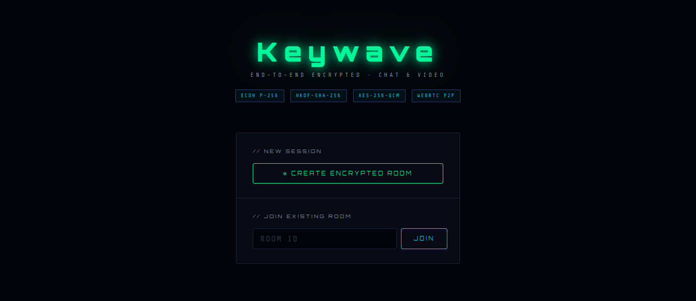
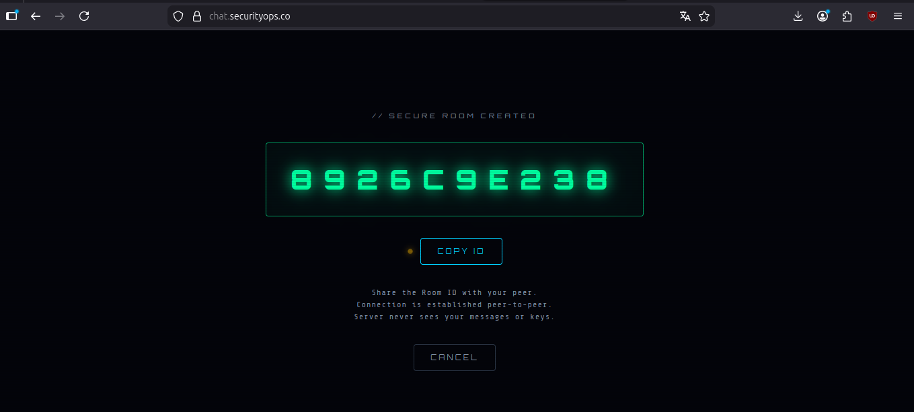
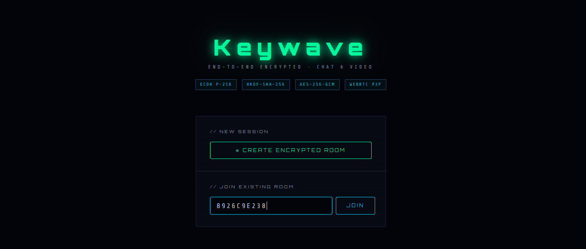

# Keywave

End-to-end encrypted, peer-to-peer chat and video. One small service, no
accounts, no persistence. The server only relays the handshake; it never sees
message or call content.





## Features

- 1:1 text chat and video/audio calls, encrypted in the browser.
- Works on desktop and mobile with a responsive, touch-friendly layout.
- Invite by link: a share sheet plus one-tap WhatsApp, Telegram, email, and SMS,
  or copy the link / room ID. Opening an invite link auto-joins the room.
- Safety-number verification (named emoji + hex) to detect a man-in-the-middle.
- HD video (720p/30) with per-frame media encryption on Chromium browsers,
  negotiated bilaterally and falling back to DTLS-SRTP with other browsers.
- Single self-contained service: the client is embedded in `app.py` and all
  assets (socket.io, fonts) are self-hosted. No CDN, no third-party origins.

## Quick start

```bash
docker compose up -d --build
```

Open <http://localhost:5128>. To try it on one machine, open it in two browser
windows: create a room in the first, copy the room ID, and join with it in the
second. `localhost` is a secure context, so the camera and Web Crypto work
without TLS.

Endpoints: `GET /healthz` (status + active room count) and `GET /config` (ICE
servers for the client).

## Connecting a peer

Create a room. The waiting screen shows an invite link and quick share buttons:
a native share sheet (covering Signal, Session, Tox, Element, and anything else
installed) plus one-tap WhatsApp, Telegram, email, and SMS, with "Copy" for the
link and "Copy ID" for the room ID alone. The room ID travels in the URL
fragment (`#room=ID`), which browsers never send to the server, and opening the
link auto-joins the room. There is also an invite button (↗) in the call
controls.

A room holds at most two peers and is one-time use: anyone who has the link can
take the second slot, so after connecting, verify the safety number (see
[SECURITY.md](./SECURITY.md)) to confirm no one is in the middle.

## Running on a phone or over a network

Phones can't use `localhost`, so they need a secure context (HTTPS) over the
network. Two practical options:

1. **Reverse proxy with a real certificate** (recommended). Put Keywave behind
   Nginx Proxy Manager, Caddy, or Traefik with a domain and a Let's Encrypt
   certificate, pointed at `http://keywave:5000` with WebSocket upgrade headers
   enabled. See the notes at the bottom of `docker-compose.yml`.
2. **A tunnel** (cloudflared, ngrok, tailscale-funnel) that terminates HTTPS.

### Making calls connect reliably (TURN)

Calls connect peer-to-peer using public STUN. Between two different real
networks — two mobile carriers, corporate firewalls, or carrier-grade NAT —
direct P2P often fails, which is why a call can work on `localhost` but not
between a phone and a laptop on the internet. **STUN-only is effectively
localhost/LAN-only**; the waiting screen warns when no relay is configured and
the server logs a warning at startup. The fix is a **TURN relay**, and this
build ships one you can turn on:

```bash
cp .env.example .env          # then edit .env
#   KEYWAVE_TURN_HOST=turn.example.com      (public host both peers can reach)
#   KEYWAVE_TURN_SECRET=<openssl rand -hex 32>
#   KEYWAVE_TURN_EXTERNAL_IP=<your public IP>   (on AWS/GCP/Oracle 1:1-NAT VPS)
docker compose --profile turn up -d --build
```

That starts a bundled `coturn` alongside Keywave. The app mints short-lived TURN
credentials per client (coturn's `use-auth-secret` scheme) and serves the ICE
configuration from `GET /config`, so no client edits are needed. The single
`.env` value reaches both the app and coturn, so credentials always match;
coturn refuses to start without a real secret.

Two deployment gotchas worth calling out:

- **Open the ports.** UDP/TCP **3478** and UDP **49160–49200** must be reachable
  on your firewall / cloud security group.
- **Set the public IP on NAT'd clouds.** On AWS/GCP/Oracle (and any 1:1-NAT
  host) the VM's NIC holds a private IP, so coturn would otherwise advertise an
  unroutable relay address and media silently fails. Set
  `KEYWAVE_TURN_EXTERNAL_IP` to the public IP (or `<public>/<private>`).

Already run a TURN server? Point Keywave at it instead with `KEYWAVE_TURN_URL`,
`KEYWAVE_TURN_USER`, and `KEYWAVE_TURN_PASS` (a `turns:` URL on 443 works for
clients behind HTTPS-only egress). To confirm relaying works end to end, set
`KEYWAVE_FORCE_RELAY=1` — it forces all media through TURN, so a call that still
connects proves the relay is good.

Connections self-heal: trickle ICE candidates are queued (never dropped), a
broken path triggers a bounded ICE-restart, and a dropped WebSocket reconnects
and rebinds to the room within a grace window (`KEYWAVE_GRACE_TTL`, default 90s)
instead of ending the call.

## Configuration

Everything is optional and set via environment variables.

| Variable | Purpose | Default |
| --- | --- | --- |
| `KEYWAVE_PORT` | Bind port inside the container | `5000` |
| `KEYWAVE_ALLOWED_ORIGINS` | CORS allowlist (`*` or comma-separated) | `*` |
| `KEYWAVE_MAX_ROOMS` | Global room cap | `5000` |
| `KEYWAVE_ROOM_TTL` | Seconds a half-open room lives before reaping | `7200` |
| `KEYWAVE_GRACE_TTL` | Seconds a dropped peer's slot is held for reconnect | `90` |
| `KEYWAVE_CREATE_MAX` / `KEYWAVE_CREATE_WINDOW` | Room-creation rate limit (count / seconds) | `10` / `60` |
| `KEYWAVE_MSG_MAX` / `KEYWAVE_MSG_WINDOW` | Relayed-message rate limit (count / seconds) | `120` / `10` |
| `KEYWAVE_MAX_PAYLOAD` | Max bytes per relayed field | `262144` |
| `KEYWAVE_STUN` | Comma-separated STUN URLs | two public Google STUN |
| `KEYWAVE_TURN_HOST` | Public host of the bundled coturn (enables minted TURN creds) | _(unset)_ |
| `KEYWAVE_TURN_SECRET` | Shared secret matching coturn `static-auth-secret` (placeholder is ignored) | _(unset)_ |
| `KEYWAVE_TURN_EXTERNAL_IP` | Public IP coturn advertises (required on 1:1-NAT clouds) | _(unset)_ |
| `KEYWAVE_TURN_TLS` | Also advertise `turns:` on 443 (needs TLS coturn) (`1` to enable) | _(off)_ |
| `KEYWAVE_TURN_TTL` | Lifetime of a minted TURN credential (seconds) | `86400` |
| `KEYWAVE_TURN_URL` / `_USER` / `_PASS` | External TURN with static credentials | _(unset)_ |
| `KEYWAVE_FORCE_RELAY` | Force all media through TURN (`1` to enable) | _(off)_ |

Lock `KEYWAVE_ALLOWED_ORIGINS` to your real origin in production. ICE servers
are served to the client at `GET /config`; configure TURN there via the
variables above (see "Making calls connect reliably").

## How it works

Peers exchange ephemeral ECDH P-256 public keys through the relay, derive
AES-256-GCM keys with HKDF, and encrypt chat messages and media frames in the
browser. A safety number derived from the shared secret and both public keys
lets the two users confirm there is no man-in-the-middle. Full details,
including the threat model and known limitations, are in
[SECURITY.md](./SECURITY.md).

## Project layout

```
app.py             Flask + Socket.IO relay, with the client embedded as HTML
static/            Self-hosted socket.io client and fonts (no CDN)
Dockerfile         python:3.12-slim, runs app.py behind your reverse proxy
docker-compose.yml
```

## Links

- Security model and reporting: [SECURITY.md](./SECURITY.md)
- Release notes: [CHANGELOG.md](./CHANGELOG.md)
- License: [LICENSE](./LICENSE)
