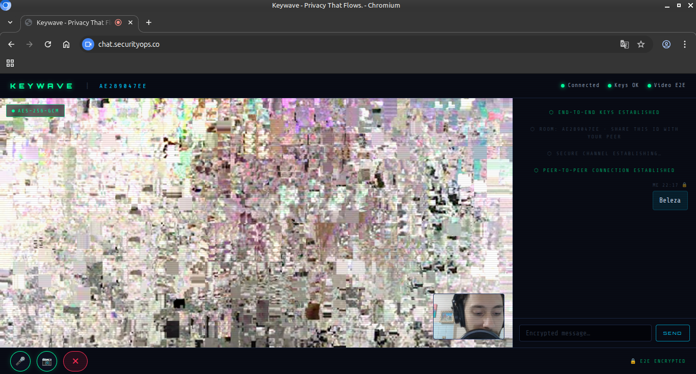

# KEYWAVE - Encrypted Chat + Video

"Privacy That Flows."

Single-service replacement for SecChat + TempChat.



## Crypto Architecture

```
 PEER A                              SERVER (relay only)              PEER B
─────────────────────────────────────────────────────────────────────────────
 X25519 keypair gen                                           X25519 keypair gen
       │                                                             │
       ├─── pubkey ──────────────────────────────────────────────────►│
       │◄─── pubkey ─────────────────────────────────────────────────┤
       │                                                             │
       ├─ crypto_kx_server_session_keys() ─────────────────────────── crypto_kx_client_session_keys() ─┤
       │  → sessionRx, sessionTx                                     │  → sessionRx, sessionTx
       │                                                             │
  CHAT: XChaCha20-Poly1305                                      CHAT: XChaCha20-Poly1305
    encrypt(msg, sessionTx) ─── ciphertext+nonce ──────────────► decrypt(ct, sessionRx)
                                  (relay only)
       │                                                             │
  VIDEO: AES-256-GCM (WebRTC Insertable Streams)                    │
    importKey(sessionTx) ──── encrypted RTP frames (P2P) ─────────► importKey(sessionRx)
    importKey(sessionRx) ◄─── encrypted RTP frames (P2P) ──────────  importKey(sessionTx)
```

### Key properties
- **X25519 ECDH** ephemeral per-session, never stored
- **crypto_kx** uses BLAKE2b-based KDF (libsodium)
- **XChaCha20-Poly1305** authenticated encryption for text (24-byte nonce, 256-bit key)
- **AES-256-GCM** per-frame video/audio encryption via WebRTC Insertable Streams
- **Server** sees only: public keys, base64 ciphertext, WebRTC SDP/ICE
- **No persistence** rooms and sessions are entirely in-memory

## Requirements

- Docker + Docker Compose
- **Chrome/Chromium 86+** for Insertable Streams (AES-GCM video layer)
- Firefox: chat E2E works; video falls back to DTLS-only (WebRTC native encryption)

## Deploy

```bash
docker compose up -d
```

## Behind Nginx Proxy Manager

Point NPM at `http://keywave:5000`. In the **Advanced** tab:

```nginx
proxy_http_version 1.1;
proxy_set_header Upgrade $http_upgrade;
proxy_set_header Connection "upgrade";
proxy_read_timeout 86400;
```

WebSocket upgrade is required for Socket.IO signaling.

## File Structure

```
.
├── app.py              # Flask signaling server (zero persistence)
├── requirements.txt
├── Dockerfile
├── docker-compose.yml
└── index.html          # Complete SPA (HTML + CSS + JS, no build step)
└── images/             # Screenshots
   ```
